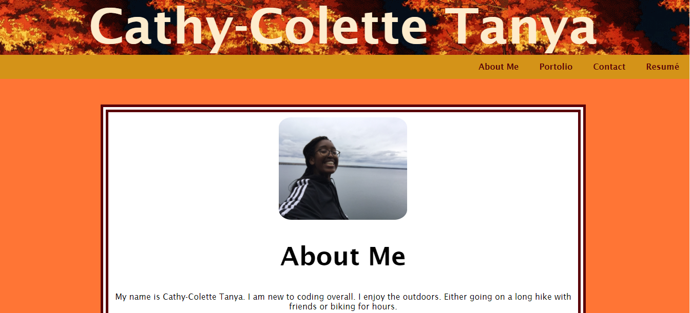

# Homework #7: Portfolio Updated

## Purpose:
Updating the portfolio application is important.
It will make sure that it will be ready to present to potential employers following graduation.
It should demonstrate what individuals have learned in the class.

## Critieria
- Display contact information
- Have links to the GitHub profile and Linkdin
- Link to downloadable PDF of your resume
- Display at least 2 examples of student work from their deployed project/homework.
  For each project, make sure you have the following:
    - Project title
    - Link to the deploy version
    - Link to the GitHub repo
    - Screenshot of the deployed application
- Have a polished, mobile responsive user interface

## Screenshot

